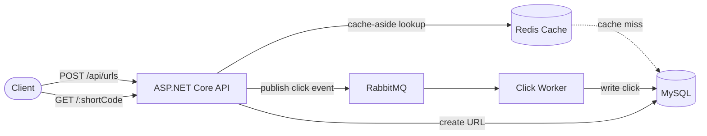

# Distributed URL Shortener

A production-style URL shortening service built to demonstrate distributed systems fundamentals — caching, async message processing, and horizontal scalability — rather than just basic CRUD.

**Live demo:** [urlshortener-api.wonderfulbeach-0dbc4d22.centralindia.azurecontainerapps.io](https://urlshortener-api.wonderfulbeach-0dbc4d22.centralindia.azurecontainerapps.io)
**Stack:** ASP.NET Core · EF Core · MySQL · Redis · RabbitMQ · Docker · Azure Container Apps

---

## Overview

This service shortens long URLs, redirects visitors to the original destination, and tracks click analytics — but the implementation focuses on how the system behaves under concurrent load, not just whether the features work.

Three architectural decisions drive the design:

1. **Cache-aside Redis caching** on the redirect (read) path, to avoid hitting MySQL on every request
2. **Async click tracking via RabbitMQ**, decoupling analytics writes from the redirect response
3. **Base62-encoded, auto-increment-derived short codes**, avoiding a collision-check query on every URL creation

---

## Architecture



**Request flow — creating a short URL**

1. Client submits a long URL
2. API validates it (`Uri.TryCreate`, scheme restricted to http/https)
3. Row inserted into MySQL to obtain an auto-generated `UrlId`
4. `UrlId` is base62-encoded into a short code and written back to the same row
5. Full short URL returned to the client

**Request flow — visiting a short URL**

1. API checks Redis for the short code (cache-aside)
2. On a cache hit, the original URL is returned immediately — no database hit
3. On a cache miss, MySQL is queried, and the result is written back into Redis for next time
4. A click event is published to RabbitMQ (fire-and-forget) — the redirect is **not** blocked waiting on this
5. A separate worker service consumes the queue and persists the click to MySQL
6. Client is redirected (HTTP 302) to the original URL

---

## Why these design choices

**Redis, cache-aside pattern.** Redirects are the highest-traffic, most latency-sensitive path in a URL shortener. Serving repeat lookups from memory avoids a database round-trip on nearly every request.

**RabbitMQ for click tracking.** Writing analytics synchronously would make every redirect wait on an extra database insert. Publishing to a queue lets the redirect return immediately while a separate worker handles the write — trading strict consistency (click counts lag by a few milliseconds) for lower, more predictable redirect latency.

**Base62-encoded auto-increment IDs, not random strings.** An earlier version generated a random code and checked the database for a collision before every insert — correct, but every single creation paid for a network round-trip just to confirm something that was true 99.999999% of the time. Encoding the database's own auto-increment ID removes that check entirely, at the cost of one extra write per creation (the code can only be computed after the row exists and has a real ID). At the point this stops scaling — e.g. once the database is sharded across multiple servers and a single auto-increment counter is no longer available — a Snowflake-style generator (timestamp + machine ID + sequence) would be the next step, since it produces globally unique IDs without any coordination between shards.

---

## Load test results

Tested locally with [k6](https://k6.io/), 50 concurrent virtual users, hitting the redirect endpoint for 60 seconds. Script: [`performance/redirect-load-test.js`](./performance/redirect-load-test.js).

```javascript
import http from "k6/http";
import { check } from "k6";

export const options = {
  vus: 50,
  duration: "1m",
};

const BASE_URL = "http://localhost:8080";
const SHORT_CODE = "8";

export default function () {
  const response = http.get(`${BASE_URL}/${SHORT_CODE}`, {
    redirects: 0,
  });

  check(response, {
    "status is redirect": (r) => r.status === 301 || r.status === 302,
  });
}
```

The test repeatedly hits a single, already-created short code — maximizing cache hits in the "with Redis" run, and isolating the effect of the cache-aside lookup on the redirect path specifically. `redirects: 0` stops k6 from automatically following the redirect, so each request only measures the API's own response time, not the destination page's load time.

Run it yourself with `k6 run performance/redirect-load-test.js` once the local stack is up.

| Metric                      | With Redis caching | Without caching | Change          |
| --------------------------- | ------------------ | --------------- | --------------- |
| Throughput                  | 823.1 req/s        | 150.4 req/s     | **5.5x higher** |
| Avg latency                 | 60.5 ms            | 191.4 ms        | 3.2x lower      |
| p95 latency                 | 98.6 ms            | 116.3 ms        | ~18% lower      |
| Max latency                 | 232 ms             | 30.15 s         | —               |
| Failed / timed-out requests | 0                  | 50              | —               |
| Error rate                  | 0%                 | 0%\*            | —               |

\*No HTTP-level errors, but 50 iterations were interrupted after exceeding the test's time budget — a symptom of MySQL's connection pool saturating under concurrent load once every request bypassed the cache.

**Takeaway:** removing the cache didn't just make individual requests modestly slower — it collapsed overall throughput and introduced request timeouts, since every one of the 50 concurrent users was now competing for a limited number of MySQL connections instead of being served from memory.

Separately, on the deployed Azure instance (Azure Container Apps, single instance, no autoscaling configured): **135 req/s, 368 ms avg latency, 471 ms p95, 0% errors** at 50 VUs — lower than the local Redis-enabled numbers above, primarily due to network latency to Azure and the RabbitMQ publisher opening a new connection per request (see _Known limitations_ below).

---

## Tech stack

| Layer            | Choice                                                          |
| ---------------- | --------------------------------------------------------------- |
| API              | ASP.NET Core (.NET 9), REST                                     |
| ORM / Database   | EF Core, MySQL (Pomelo provider)                                |
| Caching          | Redis, cache-aside pattern                                      |
| Messaging        | RabbitMQ, dedicated consumer worker service                     |
| Containerization | Docker, Docker Compose (local), Azure Container Apps (deployed) |
| Registry         | Azure Container Registry                                        |
| Testing          | xUnit, EF Core In-Memory provider, Moq                          |
| Docs             | Swagger / OpenAPI                                               |

---

## Project structure

```
UrlShortener/
├── Controllers/        # HTTP layer — routing, status codes, no business logic
├── Services/            # UrlService — core logic (creation, lookup, stats)
├── Models/              # EF Core entities (Url, Click)
├── DTOs/                # Request/response shapes
├── Data/                # DbContext
├── Middleware/           # Global exception handling
ClickWorker/              # Standalone RabbitMQ consumer — writes clicks to MySQL
UrlShortener.Tests/        # xUnit tests
performance/               # k6 load test scripts
```

---

## API endpoints

| Method | Route                         | Description                                     |
| ------ | ----------------------------- | ----------------------------------------------- |
| `POST` | `/api/urls`                   | Create a short URL from a long one              |
| `GET`  | `/{shortCode}`                | Redirect to the original URL, logs a click      |
| `GET`  | `/api/urls/{shortCode}/stats` | Total clicks and clicks-per-day for a short URL |

Full interactive documentation available via Swagger at `/swagger` when running locally.

---

## Running locally

Requires Docker and Docker Compose.

```bash
git clone <this-repo-url>
cd UrlShortener
docker-compose up --build
```

This starts the API, MySQL, Redis, and RabbitMQ together. The API is available at `http://localhost:8080`, with Swagger at `http://localhost:8080/swagger`.

Apply migrations (first run only):

```bash
dotnet ef database update --connection "server=localhost;port=3306;database=urlshortener;user=root;password=rootpassword"
```

## Running tests

```bash
cd UrlShortener.Tests
dotnet test
```

Covers base62 encoding correctness (including boundary cases) and `UrlService`'s core creation/validation logic, using an in-memory database and a mocked Redis connection — no real database or Redis instance required to run the suite.

---

## Deployment

Deployed to **Azure Container Apps**: the API and the click-tracking worker run as two independently scaled containers within the same Container Apps Environment, communicating via RabbitMQ. Images are built with Docker and pushed to Azure Container Registry.

```bash
docker build -t urlshortener-api .
docker tag urlshortener-api <registry>.azurecr.io/urlshortener-api:latest
docker push <registry>.azurecr.io/urlshortener-api:latest
az containerapp update --name <api-app-name> --resource-group <rg> --image <registry>.azurecr.io/urlshortener-api:latest
```

---

## Known limitations / what I'd improve next

- **RabbitMQ publisher opens a new connection per request.** The current implementation creates a fresh connection and channel on every click event, which adds real connection-establishment overhead to the redirect path. A production version would use a single long-lived connection (or a connection pool), shared across requests.
- **Short codes are somewhat predictable.** Since they're derived from a sequential auto-increment ID, early codes are short and guessable in sequence. A production system would obfuscate the ID (e.g. XOR with a secret) before encoding.
- **No database sharding / Snowflake IDs.** At the current scale, a single MySQL instance with base62-encoded auto-increment IDs is sufficient. Sharding would require moving to a coordination-free ID scheme.
- **No autoscaling configured** on the deployed Container Apps — the Azure load test numbers reflect a single running instance.

---

## What this project demonstrates

- Cache-aside caching strategy and its measurable impact under load
- Decoupling write-heavy side effects (analytics) from the critical request path via message queuing
- Understanding the tradeoffs of different unique-ID generation strategies, including when and why to graduate to a distributed ID scheme
- Containerized, multi-service deployment to a managed cloud platform
- Load testing methodology, including designing a fair before/after comparison to isolate the effect of a single architectural change
